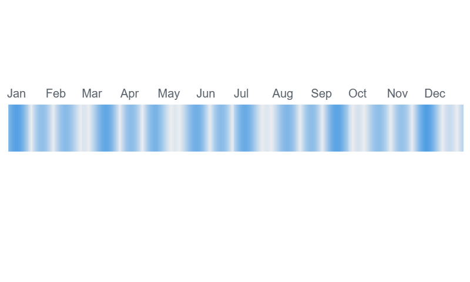

# Annual Ribbon

A compact 365-cell horizontal band for Metabase — one cell per day of the year, colored by value intensity. Instantly reveals seasonal patterns and daily trends at a glance.



## Requirements

- Metabase **≥ 1.62.0**

## Installation

1. Download `annual-ribbon-X.Y.Z.tgz` from the [latest release](https://github.com/ouquoi/metaviz-annual-ribbon/releases/latest)
2. In Metabase, go to **Admin → Visualizations**
3. Click **Add a visualization**
4. Upload the `.tgz` file

## Usage

### Query

Your question must return at least one date column and one numeric column:

```sql
SELECT
  date_trunc('day', created_at)::date AS day,
  COUNT(*) AS validations
FROM events
GROUP BY 1
ORDER BY 1
```

### Select the visualization

In the question editor, open the visualization picker and select **Annual Ribbon**.

### Configure settings

#### Data

| Setting | Description | Default |
|---------|-------------|---------|
| Date column | Column used as the day key | First date column |
| Value column | Column used for color intensity | First numeric column |

#### Appearance

| Setting | Description | Default |
|---------|-------------|---------|
| Band height | Height of the ribbon in pixels | `40` |
| Color — low values | Color for the lowest values | `#ebedf0` |
| Color — high values | Color for the highest values | `#509EE3` |

## Capabilities

| Feature | Details |
|---------|---------|
| Hover tooltip | Highlights the hovered day, dims others, shows date and value |
| Drill-through | Click a day cell to filter by that date |
| Animation | Cells fade in sequentially on load (SVG native, sandbox-safe) |
| Dark mode | Full dark theme support |
| Responsive | Adapts to any card size |
| Missing days | Days absent from the data are shown as empty (neutral) cells |

## Data requirements

| Column | Type | Notes |
|--------|------|-------|
| Date column | Date / DateTime | One row per day; duplicate days use the last encountered value |
| Value column | Numeric | Negative and null values are treated as missing (empty cell) |

The visualization requires exactly one date column and one numeric column. If either is missing, a clear error message is displayed.

## Development

```bash
cd annual-ribbon
npm install
npm run dev          # watch mode — connect Metabase dev server to http://localhost:5174
npm run preview:viz  # standalone preview at http://localhost:5176
npm run build        # compile + generate .tgz
```

The Metabase dev server must point to `http://localhost:5174`. See the [custom-viz SDK documentation](https://github.com/metabase/metabase/tree/master/enterprise/frontend/src/metabase-types) for setup instructions.

## License

MIT
